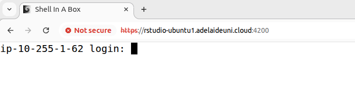
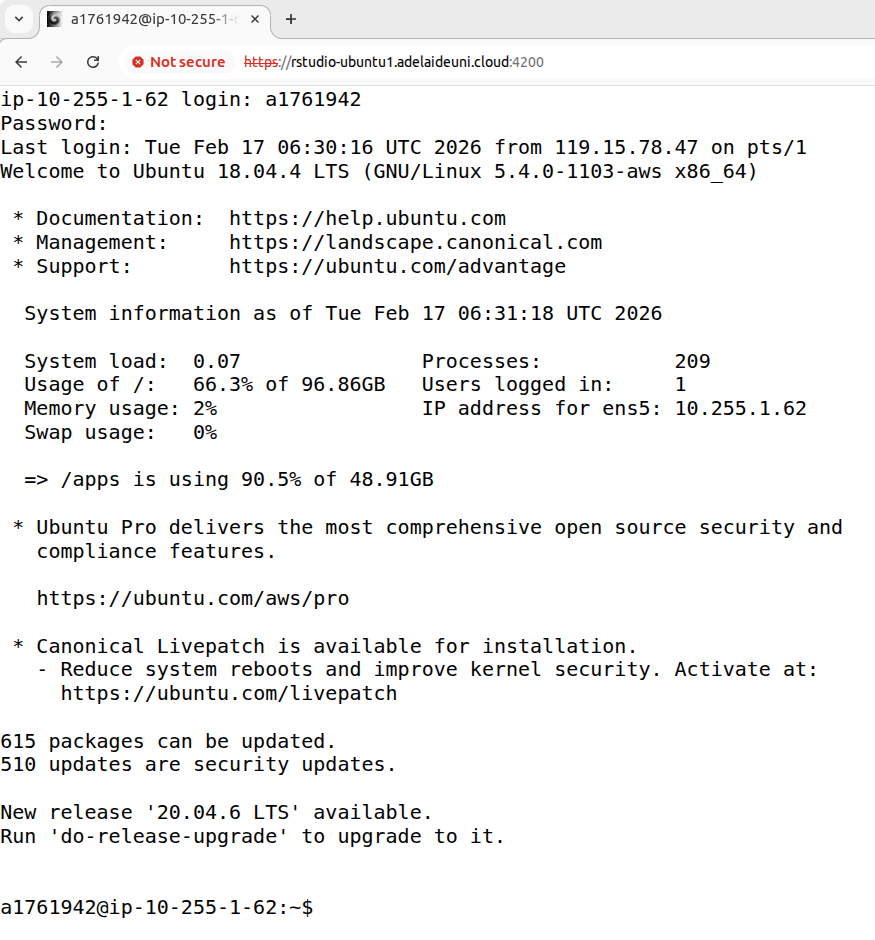
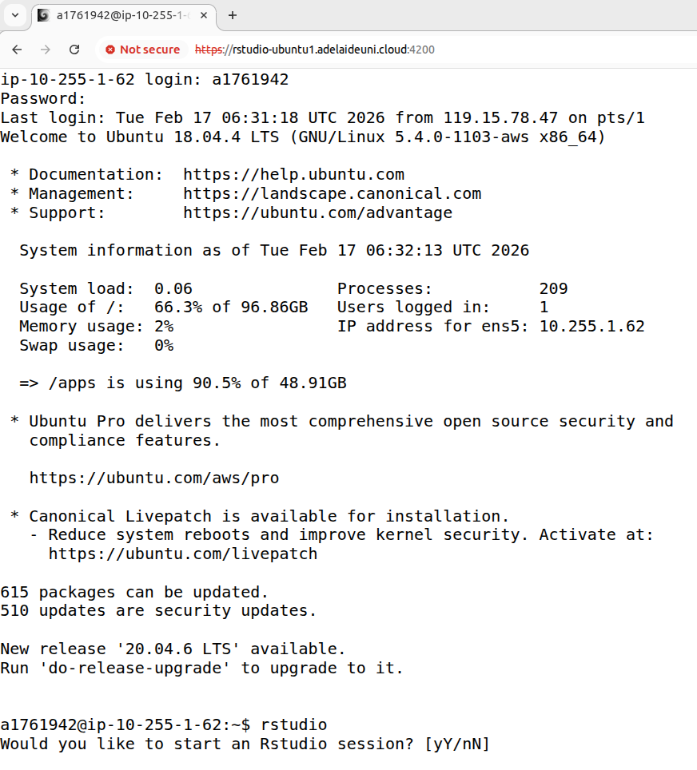
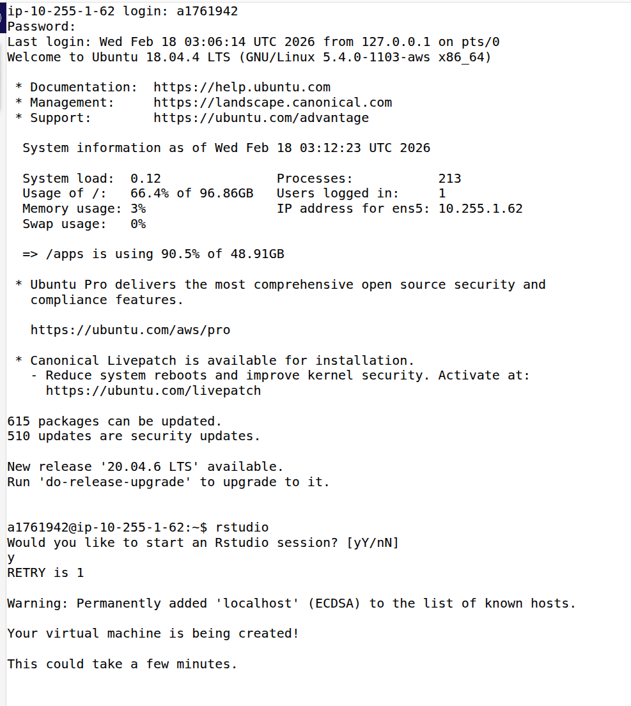
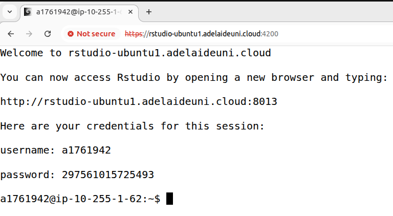
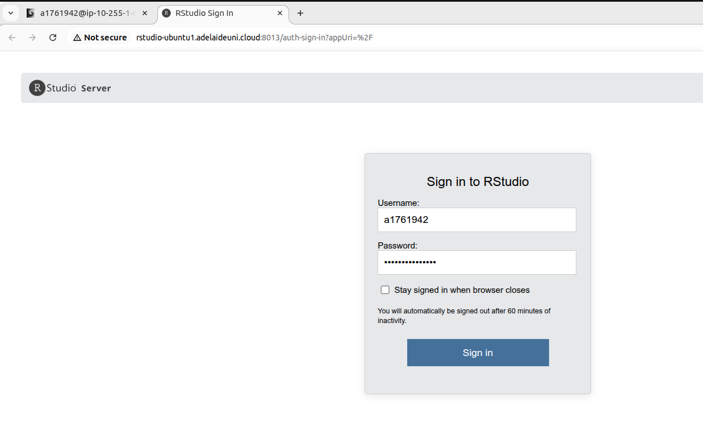

# Connecting to your Virtual Machine

You have each been given access to a virtual machine that runs in a cloud compute environment and is accessed using the IP address below.

`https://rstudio-ubuntuN.adelaideuni.cloud:4200` where `N` is the machine you want to login to.

All cloud computing accounts are private but are identical and we will use these for the entire practical series. 
Accessing your cloud compute resource is like having your very own server. 

## Login instructions

### 1. Open an internet browser. 
We recommend Firefox, but Edge/Chrome are also acceptable. Safari has not been tested.

### 2. Enter your login node address 
Paste the login node address (`https://rstudio-ubuntuN.adelaideuni.cloud:4200`) into the address bar, where N is the number of the machine you'll be using.

Outside of practical times, only `ubuntu1` will be available. 
During practicals, use the machine number allocated to you. 
 
Ignore any warning about this being insecure.

You should see the login screen below.

### 3. Enter username and password for login node

Enter your Adelaide University anumber (this is your userID) and press enter. 

Enter the password you were assigned. 
You won't see anything happening while typing your password. Just finish typing it and press enter. 

You should see something like below if login is successful.

### 4. Tell the login node to get your VM ready

Type `rstudio` and press Enter.

You'll then be asked `Would you like to start an Rstudio session?` as shown below. Type `y` and press enter. 

Now you should see the following. 

You will likely see a number of `PENDING` messages appear. Keep waiting. 
During Practicals, login will (usually) be faster than outside of practical times.

Once your VM is ready, (this may take a couple of minutes), the screen will clear and be replaced with instructions on how to login, similar to below:

These instructions include:
- a web address similar to `http://rstudio-ubuntu2.adelaideuni.cloud:8001`
- your username for the session (your anumber)
- a onetime password for the session

### 5. Login to your VM

To login, copy the onetime password and then click the web address.
If clicking the web address doesn't open a new tab, you'll need to copy and paste it into a new tab. 

In the new tab, enter your username (your anumber), and the onetime password that was just generated. 

Click "Sign in". 

**Note:** You have 2 minutes from when the password was generated to login. If you don't login in time, you'll have to start again. 

You should now be in your Virtual Machine!!! 

Practice how to [disconnect from your VM](vm_logout_instructions.md) and then re-connect and go back to the practical instructions.

[Back to Intro to BASH Practical 1](http://university-of-adelaide-bx-masters.github.io/Fundamentals_of_Bioinformatics/Practicals/prac_1_introtobash1.html)

## Important information

- Every time you log in to your VM you will be given a new one-time password that you have to paste into the Rstudio login panel.
- You can only have one VM running (per student) at a time. If you try to login to a second VM while you have a session already running, the existing session will be cancelled.
- RStudio sessions automatically shut down after 3 hours. If this happens and you are still working, log in again and you can resume where you left off. This is because we pay by the minute for access to this resource. Please remember to log out of RStudio and disconnect (see below) when you are done so that we don't pay for compute resources that are not being used. 

## Troubleshooting

#### Can't navigate to the login node

- Make sure the address begins with `https:` and **NOT** `http:`. ie. `https://rstudio-ubuntu1.adelaideuni.cloud:4200` to login to ubuntu1
- Try a different web browser
- Try using incognito mode

#### Onetime password isn't working:

If copy and pasting your onetime password doesn't seem to work, check/try the following:
- Make sure it hasn't been longer than 2 minutes since the password was generated. If it has, you'll need to start again. 
- Make sure you haven't copied any spaces as well as the password
- Try to paste as `plain text` into the Password field
- Copy your password to a plain text document, and then re-copy it to the Password field
- Last resort, type the password by hand

