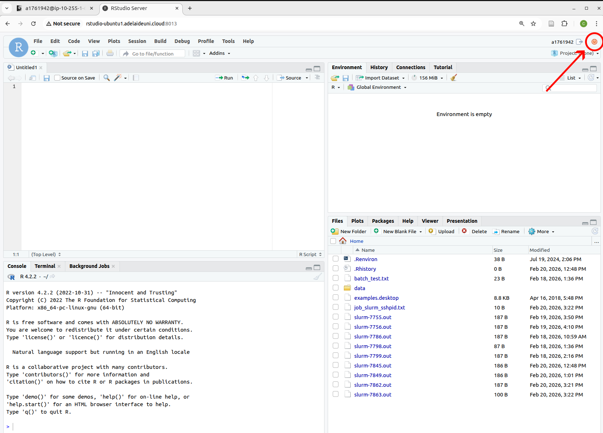
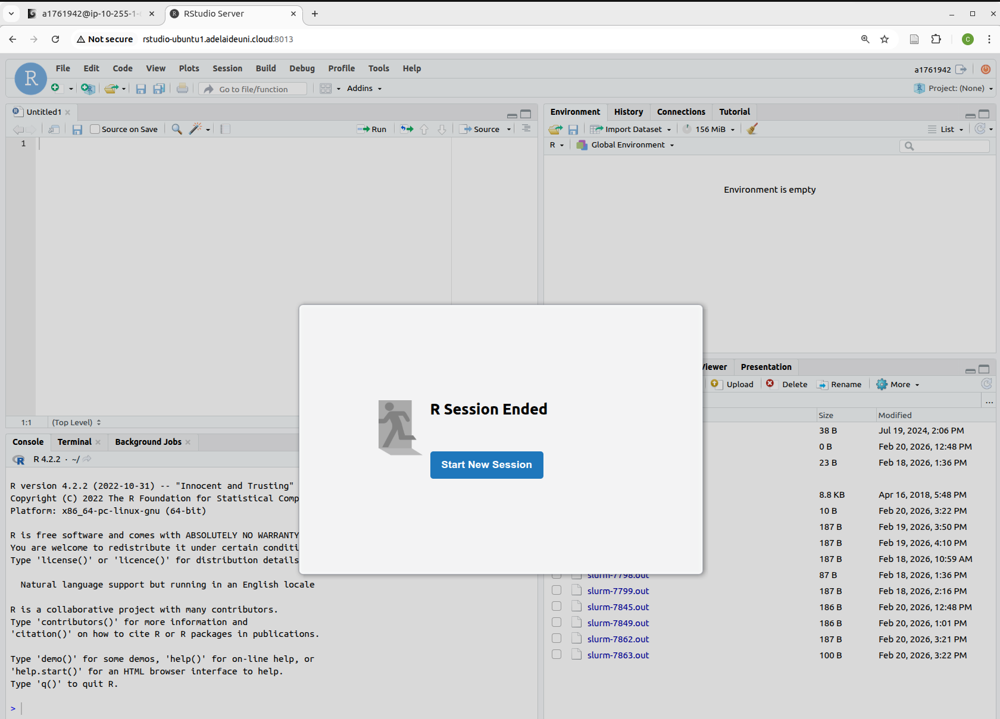
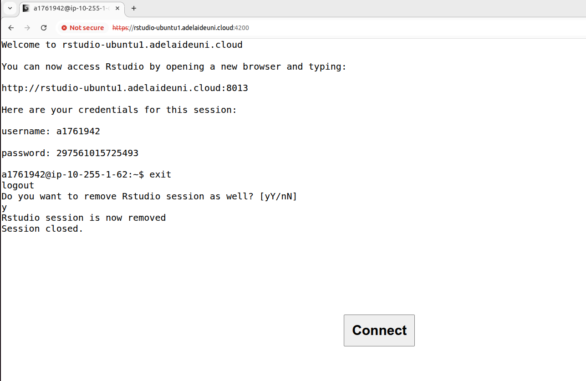

# How to disconnect from your VM

When you are done working on your VM and need to disconnect you first need to logout from RStudio.

### 1. Click the off button in the RStudio browser

Click the on/off button at the top right of the RStudio window (shown with an arrow pointing at a red circle)

### 2. Close the RStudio tab

Once you see the R Session Ended message (as below), close the RStudio tab.

### 3. Shut down the VM from the login node

- Find the tab for the login node (the page that gave you the onetime password and web address for your VM session). 
- Type `exit` and press enter
- When asked `Do you want to remove Rstudio session as well? [yY/nN]`, type `y` and press enter. You should see the following: 

If you realise at this point that you forgot to do something in your VM and want to log back in (using the same 3hr session), just push the __Connect__ button.
 
If not, close this tab or exit the browser. 

[Back to connection instructions](./vm_login_instructions.md)
