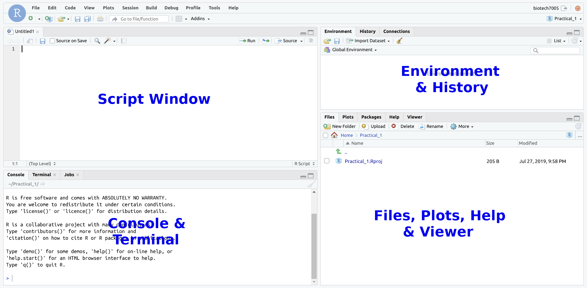
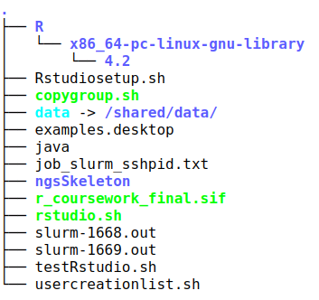

# [Fundamentals of Bioinformatics](https://university-of-adelaide-bx-masters.github.io/Fundamentals_of_Bioinformatics/)


# Introduction to Bash Part 1

## Virtual Machines

The practicals that you will be participating in will make use of cloud compute resources that are provided by Adelaide University as a [virtual machine](https://en.wikipedia.org/wiki/System_virtual_machine) (VM).
The VM is essentially a program that is running on a server but which behaves as though it is an individual separate computer.
You will be able to log in to the VM and interact with the programs that it has installed.
The VMs provided each have 2 virtual CPU cores, 16GB of system memory and a lot of shared hard disk space. That said, I encourage you to keep your stored files to a sensible minimum. Delete old data that you have moved from `./data` to your directory as it can be moved back if needed. 
They are yours to use for the semester, but they are also yours to look after.
The University runs these VMs on AWS RONIN (Amazon Web Services) and pays by the minute for `cpu` time and for the storage. Because of this, we have implemented auto shutdown of VMs after a 3 hour period. If you are still working in your VM after 3 hours and it shuts down, just log back in and continue working.

**Please [go here](https://university-of-adelaide-bx-masters.github.io/Fundamentals_of_Bioinformatics/Course_materials/vm_login_instructions.html) for instructions on connecting to your VM.**

## RStudio

You will be using a program called RStudio to interact with your VM.
Each VM has RStudio Server running on it and serving a web page that you can interact with via a web browser.

When you have connected to the VM, you should see something that looks like this.



You will only be using the Terminal part (pane) of the RStudio window.
You can maximise the Terminal pane with the icon on the top right of that section of the window.

An important step in many analyses is moving data around on a high-performance computer (HPC), and setting jobs running that can take hours, days or even weeks to perform.
For this, we need to learn how to write scripts which perform these actions, and the primary environment for this is `bash`.

We can utilise `bash` in two primary ways:

1. Interactively through the terminal
2. Through a script which manages various stages of an analysis

For most of today we will work interactively, however a complete analysis should be scripted so we have a record of everything we do.
This is often referred to as *Reproducible Research*, and in reality, our scripts are like an electronic lab book and will help you remember exactly what analyses you have performed.
When you're writing up methods for a report, paper or thesis, referring back to your scripts will be very useful.

## Running `bash` on your VM

All computers running MacOS and Linux have a terminal built-in as part of the standard setup, whilst for Windows there are several options, including `git bash` which also enables use of version control for your scripts.
To keep everything consistent for this practical, we'll use the terminal which is available inside `RStudio`.
Note that even though we're using `RStudio`, we won't be interacting with `R` today as `R` runs interactively in the `Console`.
Instead we'll be using one of the other features provided by `RStudio` to access `bash`

To access this, open `RStudio` and make sure the `Console` window is visible.
Inside this pane, you will see a **Terminal** Tab so click on this and you will be at an interactive terminal running `bash`.

We'll explore a few important commands below, and the words *shell* and *bash* will often be used interchangeably with the terminal window.

If you've ever heard of the phrase **shell scripts**, this refers to a series of commands like we will learn in these sessions, strung together into a plain text file, and which is then able to be run as a single process.

Although we haven't specifically mentioned this up until now, your virtual machines are running a distribution of Linux, and we can access these machines by logging in remotely, as well as through the `RStudio` interface.


## Setup the directory for today

First we will set up a directory for this week's practicals.
All of the the work we do in the first three Introduction to Bash practicals will be performed in this directory.
In general it is very worthwhile to keep all your project-specific code and data organised into a consistent location and structure.
This is not essential, but is very useful and is good practice.
If you don't follow this step, you will be making your life much harder and will not be following 'best practice' data analysis.

To make and enter the directory that you will be working in, run the following commands in the terminal pane (try to figure out what they mean — we will be going over them more later in the prac).

```
mkdir ~/Practical_1
cd ~/Practical_1
```

You will now find yourself in this directory you have created.
If you look at the bottom right pane of your RStudio session you will see `Practical_1` appeared when you executed `mkdir ~/Practical_1`.
If you need to, you can navigate through the directories and select files with the file navigation pane just as you would with a normal file browser.

Making this directory to work in will help you keep everything organised so you can find your work later.
Managing your data and code well is a considerable challenge in bioinformatics.


## Initial Goals

Now we have setup our VM, the basic aims of the following sessions are:

1. Gain familiarity and confidence within the Linux command-line environment
2. Learn how to navigate directories, as well as to copy, move and delete the files within them
3. Look up the name of a command needed to perform a specified task
4. Get a basic understanding of shell scripting

---

## Finding your way around

Once you're in the `Terminal` section of `RStudio`, you will notice some text describing your computer of the form

```
a1234567@ip-10-255-0-115:/shared/a1234567/Practical_1$
```

The first section of this describes your username (`a1234567`) and the machine `@ip-10-255-0-115`.
The end of the machine identifier is marked with a colon (`:`).

After the colon, the string (`~/Practical_1`) represents your current directory, whilst the dollar sign (`$`) indicates the end of this path and the beginning of where you will type commands.
This is the standard interface for the Bourne-again Shell, or `bash`.

### Where are we?

#### pwd
{:.no_toc}

Type the command `pwd` in the terminal then press the <kbd>Enter</kbd> key and you will see the output which describes the current directory you are in.

```
pwd
```

The command `pwd` is what we use to **p**rint the current (i.e. **w**orking) **d**irectory.


```
/shared/a1234567/Practical_1
```

Check with your neighbour to see if you get the same thing.
If not, see if you can figure out why.

At the beginning of this section we mentioned that `~/Practical_1` represented your current directory, but now our machine is telling us that our directory is `/shared/a1234567/Practical_1`.
This raises an important and very useful point.
In `bash` the `~` symbol is a shortcut for the home directory of the current user.
If NAME1 was logged in, this would be `/shared/NAME1` whilst if NAME2 was logged in this would be `/shared/NAME2`.
As we are all logged on as `aXXXXXXX`, this now stands for `/shared/a1234567`.

Importantly every user with an account on one of our virtual machines will have their own home directory of the format `/shared/a1234567`, `/shared/a1234568` etc..
Notice that they will all live in the directory `/shared` which is actually the parent directory that all users on our system will have a home directory in, as we've just tried to explain.
This can be confusing for many people, so hopefully we'll clear this up in the next section or two.

In the above, the `/shared` directory itself began with a slash, i.e. `/`.
On a unix-based system (i.e. MacOS and Linux), the `/` directory is defined to be the root directory of the file system.
Windows users would be more familiar with seeing something similar, the `C:\` directory as the root of the main hard drive, although there are fundamental but largely uninteresting differences between these systems.
Note also that whilst Windows uses the **backslash** (`\`) to separate parts of a directory path, a Linux-based system uses the **forward slash** (`/`), or more commonly just referred to simply as "slash", marking another but very important difference between the two.

#### cd
{:.no_toc}

Now we know all about where we are, the next thing we need to do is go somewhere else.
The `bash` command for this is `cd` which we use to **c**hange **d**irectory.
No matter (almost) where we are in a file system, we can move up a directory in the hierarchy by using the command

```
cd ..
```

The string `..` means *one directory above* (the parent directory), whilst a single dot represents the current directory.

#### Directory structure as a tree  

This what the directory structure of the `root` level directory looks like, where the `.` represents `/`. 

```
.
├── Anaconda3-2022.10-Linux-x86_64.sh
├── apps
├── bin -> usr/bin
├── boot
├── dev
├── environment -> .singularity.d/env/90-environment.sh
├── etc
├── home
├── init
├── lib -> usr/lib
├── lib32 -> usr/lib32
├── lib64 -> usr/lib64
├── libexec
├── libssl1.1_1.1.0g-2ubuntu4_amd64.deb
├── libx32 -> usr/libx32
├── media
├── mnt
├── opt
├── proc
├── rocker_scripts
├── root
├── run
├── sbin -> usr/sbin
├── shared
├── singularity -> .singularity.d/runscript
├── srv
├── sys
├── tmp
├── usr
└── var
```

This is what the structure of my home directory **/shared/a12345657/** looks like, where the`.` represents `/shared/a1234567/`  



Your home directory may differ slightly from mine.


#### Question
{:.no_toc}

From which directory will `cd ..` not move to the parent directory?


Enter the above command and notice that the location immediately to the left of the \$ has now changed.
Enter `pwd` again to check this makes sense to you.

If we now enter
```
cd ..
```
a couple more times and we should be in the root directory of the file system and we will see `/ $` at the end of our prompt.
Try this and print the working directory again (`pwd`).
The output should be the root directory given as `/`.

We can change back to our home folder by entering one of either:

```
cd ~
```
or

```
cd
```


The initial approach taken above to move through the directories used what we refer to as a **relative path**, where each move was made *relative to the current directory*.
Going up one directory will clearly depend on where we are when we execute the command. 

An alternative is to use an **absolute path**.
An **absolute path** on Linux/Mac will always begin with the root directory symbol `/`.

For example, `/foo` would refer to a directory called `foo` in the root directory of the file system (NB: This directory doesn't really exist, it's an example).
In contrast, a **relative path** can begin with either the current directory (indicated by `./`) or a higher-level directory (indicated by `../` as mentioned above).
A subdirectory `foo` of the current directory could thus be specified as `./foo`, whilst a subdirectory of the next higher directory would be specified by `../foo`.
If the path does not have a `./` or `../` prefix, the current directory is used, so `foo` is the same as `./foo`.

Another common absolute path is the one mentioned right at the start of the session, specified with `~`, which stands for your home directory `/shared/a1234567`, which also starts with a `/`.

We can also move through multiple directories in one command by separating them with the slash `/`.
For example, we could also get to the root directory from our home directory by typing
```
cd ../../
```

**Return to your home directory using** `cd`.

In the above steps, this has been exactly the same as clicking through directories in our graphical folder interface that we're all familiar with.
Now we know how to navigate folders using `bash` instead of the GUI.
This is an essential skill when logged into a High Performance Computer (HPC) or a Virtual Machine (VM) as the vast majority of these run using Linux without a graphical user interface.

### Important
{:.no_toc}

*Although we haven't directly discovered it yet, most file systems used on Unix-based systems such as Ubuntu are* **case-sensitive**, whilst **Windows file systems are usually not**.
For example, the command `PWD` is completely different to `pwd` and doesn't actually exist on your (or any) default installation of `bash`.
Note that while MacOS is a unix behind the scenes, it has a semi case-insensitive file system by default.
This will cause you pain if you are not aware of it.

If `PWD` happened to be the name of a command which has been defined in your shell, you would get completely different results than from the intended `pwd` command.
Most `bash` tools are named using all lower-case, but there are a handful of exceptions.

We can also change into a specific directory by giving the path to the `cd` command using text instead of dots and symbols.
Making sure you're in your home directory we can change back into the Practical_1 directory
```
cd
cd Practical_1
pwd
```

This is where we started the session.


#### Tab auto-completion

Bash has the capacity to provide typing suggestions for command names, file paths and other parts of commands via a feature called auto-completion.
This will help you avoid a ridiculous number of typos.

If you start typing something bash will complete as far as it can, then will wait for you to complete the path, command or file name.
If it can complete all the way, it will.

Let's see this in action; change into your home folder and make two new directories.
These directories are just to demonstrate some aspects of tab auto-completion.

```
cd
mkdir Prac_test_1
mkdir Prac_test_2
```

Now to change back into your Practical_1 folder, type `cd P` without hitting enter.
Instead hit your <kbd>Tab</kbd> key and `bash` will complete as far as it can.
If you have setup your directories correctly, you should see this complete to `cd Prac` which is unfinished.
You also have `Prac_test_1` and `Prac_test_2` in your home folder, so `bash` has gone as far as it can.
Now it's up to us to enter the next letter `a` or `_` before hitting <kbd>Tab</kbd><kbd>Enter</kbd>. If you enter `_` as the next letter `cd Prac_` before pressing <kbd>Tab</kbd> it will complete to `cd Prac_test_` which is as far as it can go. 

When faced with multiple choices, we can also hit the <kbd>Tab</kbd> key twice and `bash` will give us all available alternatives.
Let's see this in action by changing back to our home folder.

```
cd
```

Now type `cd Prac` and hit the <kbd>Tab</kbd> key twice and you will be shown all of the alternatives.
You'll still have to type the `t` though to get to `Practical_1`.

Another example which will complete all the way for you might be to go up one from your home folder.

```
cd
cd ..
```

Now to get back to your home directory (`/shared/a1234567`) start typing `cd a` followed by the <kbd>Tab</kbd> key.
This should auto-complete for you and will save you making any errors.
This also makes navigating your computer system very fast once you get the hang of it.

Importantly, if tab auto-completion doesn't appear to be working, you've probably made a typo somewhere, or are not where you think you are.
It's a good check for mistakes.

You can now delete empty Prac_test_1 and Prac_test_2 directories.

```
rmdir ~/Prac_test_1
rmdir ~/Prac_test_2
```

#### Question
{:.no_toc}

Are the paths `~/Prac_test_1` and `~/Prac_test_2` relative or absolute paths?


### Looking at the Contents of a Directory

There is another built-in command (`ls`) that we can use to **list** the contents of a directory.
This is a way to get our familiar folder view in the terminal.
Making sure you are in your home directory (`cd ~`), enter the `ls` command as it is and it will print the contents of the current directory.

```
ls
```

This is the list of files that we normally see in our graphical folder view that Windows and MacOS show us by default.
We can actually check this output using `RStudio` too, so head to the **Files** tab in the `Files` window.
Click on the Home icon () and look at the folders and files you can see there.
**Do they match the output from `ls`?**
Ask for help if not.

Alternatively, we can specify which directory we wish to view the contents of, **without having to change into that directory**.
Notice **you can't do actually this using your classic GUI folder view**.
We simply type the `ls` command, followed by a space, then the directory we wish to view the contents of.
To look at the contents of the root directory of the file system, we simply add that directory after the command `ls`.

```
ls /
```

Here you can see a whole raft of directories which contain the vital information for the computer's operating system.
Among them should be the `/shared` directory which is one level above your own home directory, and where the home directories for all users are located on our Linux system. Note that our system is a special case and most Linux systems have user home directories in `/home`, not `/shared`.

Have a look inside your Practical_1 directory from somewhere else.
Tab auto-completion may help you a little.

```
cd 
ls Practical_1
```

Navigate into this folder using you GUI view in `RStudio` and check that everything matches.

#### Question
{:.no_toc}

Give two ways we could inspect the contents of the `/` directory from your own home directory.


### Creating a New Directory

Now we know how to move around and view the contents of a directory, we should learn how to create a new directory using bash instead of the GUI folder view you are used to.
Navigate to your `Practical_1` folder using `bash`.

```
cd ~/Practical_1
```

Now we are in a suitable location, let's create a directory called `test`.
To do this we use the `mkdir` command as follows (you saw this above in tab auto-completion):

```
mkdir test
```

You should see this appear in the GUI view, and if you now enter `ls`, you should also see this directory in your output.

Importantly, the `mkdir` command above will only make a directory directly below the one we are currently in as we have used a relative path.
If automating this process via a script it is very important to understand the difference between *absolute* and *relative* paths, as discussed above.

### Adding Options To Commands

So far, the commands we have used were given either without the use of any subsequent arguments, e.g. `pwd` and `ls`, or with a specific directory as the second argument, e.g. `cd ../` and `ls /`.
Many commands have the additional capacity to specify different options as to how they perform, and these options are often specified *between* the command name, and the file (or path) being operated on.
Options are commonly a single letter prefaced with a single dash (`-`), or a word prefaced with two dashes (`--`).
The `ls` command can be given with the option `-l` specified between the command and the directory and gives the output in what is known as *long listing* format.

*Inspect the contents of your current directory using the long listing format.
Please make sure you can tell the difference between the characters `l` (lower-case letter 'l') and `1` (number one).*

```
ls -l
```

The above will give one or more lines of output, and one of the lines should be something similar to:

`drwxrwxr-x 2 a1071750 a1071750       4096 Feb 23 09:40 Practical_1`

where `hh:mm` is the time of file/directory creation.

The letter `d` at the beginning of the initial string of codes `drwxrwxrwx` indicates that this is a directory.
These letters are known as flags which identify key attributes about each file or directory, and beyond the first flag (`d`) they appear in strict triplets.
The first entry shows the file type and for most common files this entry will be `-`, whereas for a directory we will commonly see `d`.

Beyond this first position, the triplet of values `rwx` simply refer to who is able to read, write or execute the contents of the file or directory.
These three triplets refer to 1) the file's owner, 2) the group of users that the owner belongs to and 3) all users, and will only contain the values "r" (read), "w" (write), "x" (execute) or "-" (not enabled).
These are very helpful attributes for data security, protection against malicious software, and accidental file deletions.

The entries `a1234567 a1234567` respectively refer to who is the owner of the directory (or file) and to which group of users the owner belongs.
Again, this information won't be particularly relevant to us today, but this type of information is used to control who can read and write to a file or directory.
Finally, the value `4096` is the size of the directory structure in bytes, whilst the date and time refer to when the directory was created.

Let's look in your home directory (`~`).

```
ls -l ~
```

This directory should contain numerous folders.
There is a `-` instead of a `d` at the beginning of the initial string of flags indicates the difference between any files and directories.
On Ubuntu files and directories will also be displayed with different colours.
**Can you see only folders, or do you have any files present in your home directory?**

There are many more options that we could specify to give a slightly different output from the `ls` command.
Two particularly helpful ones are the options `-h` and `-R`.
We could have specified the previous command as

```
ls -l -h ~
```

The `-h` option will change the file size to `human-readable` format, whilst leaving the remainder of the output unchanged.
Try it and you will notice that where we initially saw `4096` bytes, the size is now given as `4.0K`, and other file sizes will also be given in Mb etc.
This can be particularly helpful for larger files, as most files in bioinformatics are very large indeed.

An additional option `-R` tells the `ls` command to look through each directory recursively.
If we enter

```
ls -l -R ~
```

the output will be given in multiple sections.
The first is what we have seen previously, but following that will be the contents of each sub-directory.
It should become immediately clear that the output from setting this option can get very large and long depending on which directory you start from.
It's probably not a good idea to enter `ls -l -R /` as this will print out the entire contents of your file system.

In the case of the `ls` command we can also *glob* all the above options together in the command

```
ls -lhR ~
```

This can often save some time, but it is worth noting that not all programmers write their commands in such a way that this convention can be followed.
The built-in shell commands are usually fine with this, but many NGS data processing functions do not accept this convention.

#### Question
{:.no_toc}

The letter `l` and the number `1` are often confused in text, but have different meanings. What is the difference in behaviour of `ls` when run with the `-1` (digit) and `-l` (letter) options? How does `ls -1` differ from `ls` without options?


#### How To Not Panic
{:.no_toc}

It's easy for things to go wrong when working in the command-line, but if you've accidentally:

- set something running which you need to exit or
- if you can't see the command prompt, or
- if the terminal is not responsive

there are some simple options for stopping a process and getting you back on track.
Some options to try are:

| Command  | Result |
|:-------- |:------ |
| <kbd>Ctrl</kbd>+<kbd>C</kbd> | Kill the current job |
| <kbd>Ctrl</kbd>+<kbd>D</kbd> | End of input         |
| <kbd>Ctrl</kbd>+<kbd>Z</kbd> | Suspend current job  |

<kbd>Ctrl</kbd>+<kbd>C</kbd> is usually the first port of call when things go wrong.
However, sometimes <kbd>Ctrl</kbd>+<kbd>C</kbd> doesn't work but <kbd>Ctrl</kbd>+<kbd>D</kbd> or <kbd>Ctrl</kbd>+<kbd>Z</kbd> will. If you use <kbd>Ctrl</kbd>+<kbd>Z</kbd> you will need to terminate the process with `kill %1`.

#### Repeating commands with the up arrow

When working in a bash terminal, you will often need to rerun previously executed commands, such as when you mistype something and want to rerun the command with a small change. Instead of retyping the entire command from scratch, you can instead use the **up arrow key (↑)** on your keyboard. Each time you press it, Bash will show you the last command you entered. Keep pressing it to go through your command history. Using it now should allow you to see the different `ls` commands we just ran. 

If you have gone too far, you can press the **down arrow key (↓)** to move forward through your history again. 


## Manuals and Help Pages

### Accessing Manuals

In order to help us find what options are able to be specified, every command available from the shell has a manual, or a help page which can take some time to get familiar with.
*These help pages are displayed using the pager known as* `less` which essentially turns the terminal window into a text viewer so we can display text in the terminal window, but with no capacity for us to edit the text, almost like primitive version of Acrobat Reader.

To display the help page for `ls` enter the command

```
man ls
```

As before, the space between the arguments is important and in the first argument we are invoking the command `man` which then looks for the *manual* associated with the command `ls`.
To navigate through the manual page, we need to know a few shortcuts which are part of the `less` pager.

Although we can navigate through the `less` pager using up and down arrows on our keyboards, some helpful shortcuts are:

| Key    | Action |
|:---------- |:------ |
| <kbd>Enter</kbd>    | go down one line |
| <kbd>Spacebar</kbd> | go down one page (i.e. a screenful) |
| <kbd>B</kbd>        | go **b**ackwards one page |
| <kbd><</kbd>        | go to the beginning of the document |
| <kbd>></kbd>        | go to the end of the document |
| <kbd>Q</kbd>        | quit |


Look through the manual page for the `ls` command.

#### Question
{:.no_toc}

If we wanted to hide the group names in the long listing format, which extra options would we need set when searching our home directory?

We can also find out more about the `less` pager by calling it's own `man` page.
Type the command:

```
man less
```
and the complete page will appear.
This can look a little overwhelming, so try pressing `h` which will take you to a summary of the shortcut keys within `less`.
There are a lot of them, so try out a few to jump through the file.

A good one to experiment with would be to search for patterns within the displayed text by prefacing the pattern with a slash (`/`).
Try searching for a common word like *the* or *to* to see how the function behaves, then try searching for something a bit more useful, like the word *move*.

### Accessing Help Pages

As well as entering the command `man` before the name of a command you need help with, you can often just enter the name of the command with the options `-h` or `--help` specified.
Note the convention of a single hyphen which indicates an individual letter will follow, or a double-hyphen which indicates that a word will follow.
Unfortunately the methods can vary a little from command to command, so if one method doesn't get you the manual, just try one of the others.

Sometimes it can take a little bit of looking to find something and it's important to realise we won't break the computer or accidentally launch a nuclear bomb when we look around.
It's very much like picking up a piece of paper to see what's under it.
If you don't find something at first, just keep looking and you'll find it eventually.


#### Questions
{:.no_toc}

Try accessing the documentation for the command `man` all the ways you can think of. Was there a difference in the output depending on how we asked to view the documentation? Could you access the documentation for the `ls` command all three ways?


## Some More Useful Tricks and Commands

### A series of commands to look up

So far we have explored the commands `pwd`, `cd`, `ls` and `man` as well as the pager `less`.
Inspect the `man` pages for the commands in the following table and fill in the appropriate fields.
Have a look at the useful options and try to understand what they will do if specified when invoking the command.
Write your answers on a piece of paper, or in a plain text file.

| **Command** | **Description of function**   | **Useful options** |
|:----------- |:----------------------------- |:------------------ |
| `man`       | Display on-line manual        | `-k`               |
| `pwd`       | Print working directory, i.e show where you are | none commonly used |
| `ls`        | List contents of a directory  | `-a`, `-h`, `-l`   |
| `cd`        | Change directory              | (scroll down in `man builtins` to find `cd`) |
| `mv`        |                               | `-b`, `-f`, `-u`   |
| `cp`        |                               | `-b`, `-f`, `-u`   |
| `rm`        |                               | `-r` (careful...)  |
| `mkdir`     |                               | `-p`               |
| `cat`       |                               |                    |
| `less`      |                               |                    |
| `wc`        |                               | `-l`               |
| `head`      |                               | `-n#` (e.g., `-n100`) |
| `tail`      |                               | `-n#` (e.g., `-n100`) |
| `echo`      |                               | `-e`               |
| `cut`       |                               | `-d`, `-f`, `-s`   |
| `sort`      |                               |                    |
| `uniq`      |                               |                    |
| `wget`      |                               |                    |
| `gunzip`    |                               |                    |


## Putting It All Together

Now we've learned about a large number of commands, let's try performing something useful.
We'll download a file from the internet, then look through the file.
**In each step remember to add the filename if it's not given!**

1. Use the `cd` command to **make sure you are in the directory** `Practical_1`
2. Use the command `wget` to download the `gff` file `ftp://ftp.ensembl.org/pub/release-89/gff3/drosophila_melanogaster/Drosophila_melanogaster.BDGP6.89.gff3.gz`
3. Now unzip this file using the command `gunzip`.
(Hint: After typing `gunzip`, use tab auto-complete to add the file name.)
4. Change the name of the file to `dm6.gff` using the command `mv Drosophila_melanogaster.BDGP6.89.gff3 dm6.gff`
5. Look at the first 10 lines using the `head` command
6. Change this to the first 5 lines using `head -n5`
7. Look at the end of the file using the command `tail`
8. Page through the file using the pager `less`
9. Count how many lines are in the file using the command `wc -l`
