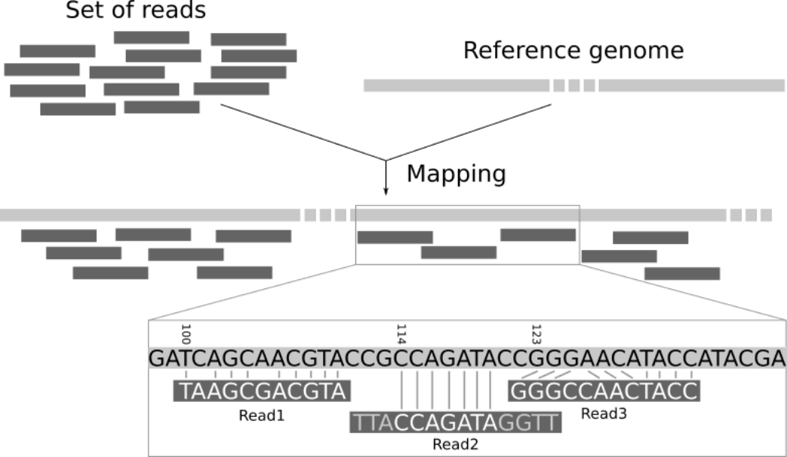
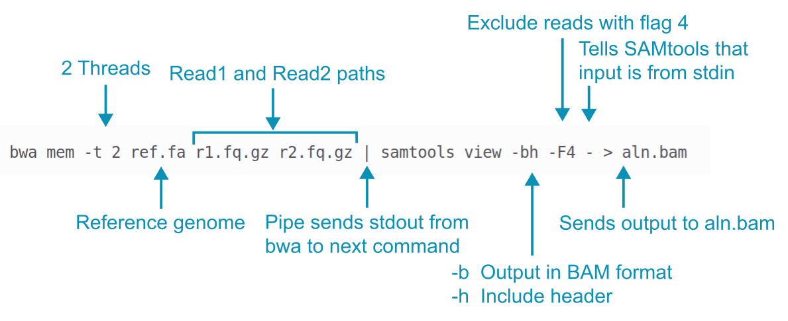
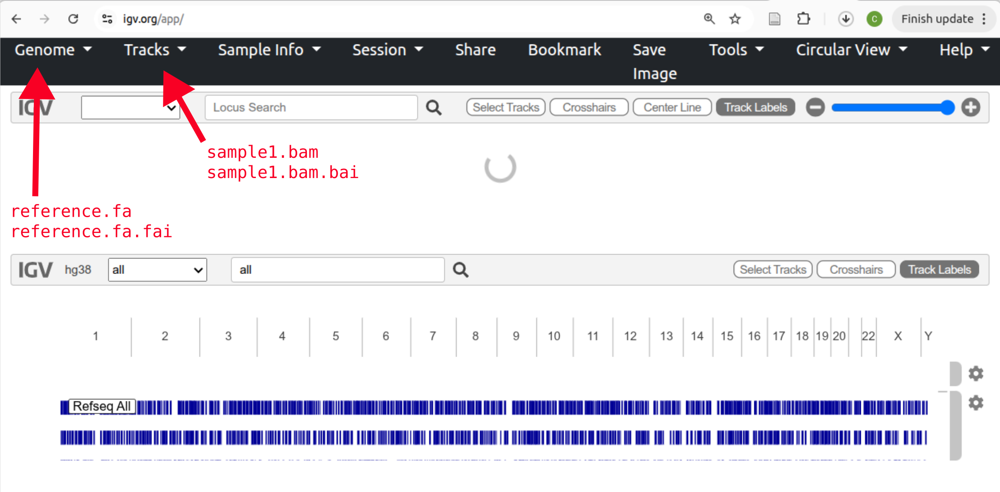
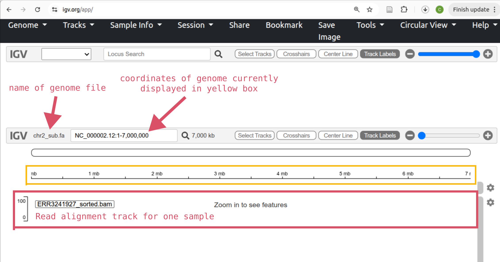
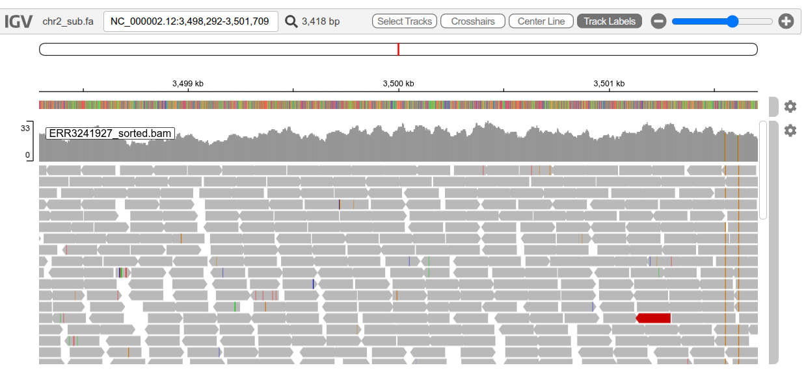

# Practical 6 - Read Alignment
{:.no_toc}

#### By Chelsea Matthews
{:.no_toc}

* TOC
{:toc}

# **1. Introduction**
This is the third practical in a set of four where we are aligning reads from three Iberian individuals to a small section of human Chromosome 2 and calling variants to determine the genotype of these individuals at the site of the SNP rs4988235. This genotype predicts lactose tolerance/intolerance.

In the last two practicals we learnt about quality control. 
We assessed the quality of our raw reads, trimmed them, and then re-assessed their quality to make sure we were happy with the trimming process. 
Now that QC is complete, we move onto the next step: aligning reads to the reference genome.

[](https://sbc.shef.ac.uk/wrangling-genomics/04-variant_calling/index.html)


## 1.1 Overview of today
A very common approach in bioinformatics is to sequence the genome of an organism (or many organisms) and compare the reads with an existing reference genome.
A reference genome is an accepted representation of an organisms genome that is used by all researchers looking at that particular organism. 
This gives us a shared coordinate system that allows us to document genomic differences in an organised way that is easy to record and communicate. 
In order to make this comparison we must "align" or "map" our reads. 
In read alignment/read mapping, we use software to find the place in the reference that best matches each read (see the figure below). 



**Basic process of aligning reads to a reference genome** from [Galaxy mapping training](https://training.galaxyproject.org/training-material/topics/sequence-analysis/tutorials/mapping/tutorial.html)

The gold standard for calculating local alignments is the Smith-Waterman algorithm but this algorithm is too slow for aligning large datasets and so heuristic methods are used to speed this up. 
One common way this is done is using the "seeding" technique to find locations where a read is likely to align and then only attempting to align that read at these locations. See the "Optimal vs Practical read mapping" video for more detail. 

How all of the reads map to the reference is documented in a specially formatted text file called a **SAM** file which has the `.sam` extension.
These files tend to be VERY large and so we compress them into **BAM** files which have a `.bam` extension. 
We'll talk about all of the information contained within SAM/BAM files and finally, we'll use IGV to visualise the read alignments against the reference genome. 

## 1.2 Learning Outcomes

1. Learn what indexes are for
2. Learn what an alignment file is (SAM and BAM) and understand the contents
3. Run commands to summarise and view mapping statistics from SAM/BAM files
4. Visualise alignment coverage

## 1.3 Setup and catchup

Let's activate our `bioinf` conda environment again.

```bash
source activate bioinf
```

We are working in the `~/Practical_alignment` directory again today and will be using the reads that we trimmed in the last practical. 

**If you didn't complete the last practical or get your script to process all three samples correctly**, running the script below will catch you up. 

To run the script:
1. Type `nano catchup.sh` to make a new bash script.
2. Paste the entire script below into it and save it by:
	1. Hold down `Ctrl` and type `x` 
	2. Type `y` when you see the message `Save modified buffer?` at the bottom of the screen (this is just asking if you want to save the file)
	3. Press enter when you see `File Name to Write: catchup.sh` at the bottom of the screen. This just means that you are saving the file as `catchup.sh`
3. Run the script with `bash catchup.sh`

```bash
#!/bin/bash

# Sample Variables
SAMPLES=(ERR3241917 ERR3241921 ERR3241927)

# load software
source activate bioinf

# create all directories and move into project directory
mkdir --parents ~/Practical_alignment/{ref,0_raw,1_trim,2_align,3_variants}
mkdir -p ~/Practical_alignment/0_raw/FastQC
mkdir -p ~/Practical_alignment/1_trim/{fastp,FastQC}

cd ~/Practical_alignment

# Get data
## make symlinks
ln -s ~/data/intro_ngs/*.fq.gz 0_raw/
# get reference
cp --no-clobber ~/data/intro_ngs/chr2_sub.fa ref/

for SAM in "${SAMPLES[@]}";
do
	# Assess raw read quality with fastqc
	fastqc -o 0_raw/FastQC -t 2 0_raw/${SAM}_*.fq.gz

	# Trim with fastp
	fastp --thread 2 \
	-i 0_raw/${SAM}_1.fq.gz \
	-I 0_raw/${SAM}_2.fq.gz \
	-o 1_trim/${SAM}_1.fq.gz \
	-O 1_trim/${SAM}_2.fq.gz \
	--unpaired1 1_trim/${SAM}_1_orphan.fq.gz \
	--unpaired2 1_trim/${SAM}_2_orphan.fq.gz \
	--cut_right \
	--cut_window_size 4 \
	--cut_mean_quality 20 \
	--length_required 75 \
	--html 1_trim/fastp/${SAM}_fastp.html

	# Assess read quality after trimming with fastqc
	fastqc -o 1_trim/FastQC --threads 2 \
	1_trim/${SAM}_{1,2}.fq.gz

done
```


# **2. The reference genome and indexing**

We will be aligning our reads to a 7Mb portion of the human reference genome GRCh38.p14.  

Let's take a look at the NCBI page for GRCh38.p14 [here](https://www.ncbi.nlm.nih.gov/datasets/genome/GCF_000001405.40/) and answer some questions. 
Note that this page includes information on both a RefSeq version and a GenBank version of GRCh38.p14. 
GenBank is a database of all publicly submitted sequences while RefSeq (which stands for 'Reference Sequence') is a subset of GenBank. 
RefSeq provides a single reference genome for each species/strain, often with improved annotations. We are using a portion of the RefSeq reference genome.  

- How long is the human reference genome?
- What is the GC content?
- What is Chromosome 2 called in the RefSeq reference genome?
- How long is Chromosome 2?

The coordinates that describe the portion of GRCh38.p14 that we are analysing are `NC_000002.12:133000000-140000000`.
- NC_000002.12 is the chromosome
- 133000000 is the start position
- 140000000 is the end position

This 7Mb section of GRCh38.p14 is in a file called `chr2_sub.fa` (meaning chromosome 2 subsequence) and is located in your `ref` directory. 
Let's take a look. 

```bash
cd ~/Practical_alignment
ls ref/
```

- What is the name of this sequence?

The first step in aligning reads to a reference genome is to index the reference genome. 
We will be using the read alignment tool "BWA" which stands for Burrows-Wheeler Aligner.
BWA which uses the burrows-wheeler transform to build an index of the reference genome (see [here](https://sandbox.bio/concepts/bwt) for a great interactive example) which works much the same as an index in a recipe book. 
It allows BWA to quickly find potential alignment sites for query sequences (reads) in a genome, which saves time during alignment. 

As long as the reference sequence stays the same, we only have to build the index once. However, an index built by `bwa` won't be able to be used by a different read alignment tool. 
Let's build the index. 

```bash
bwa index ref/chr2_sub.fa 
```

This will have created a number of files which are the index.

```bash
ls ref/
```

We don't need to look at the contents of these files as they are specific to the aligner and some of them aren't even human readable. 

# **3. Read alignment**

Now that we have trimmed our reads (last practical) and created an index for our reference, we are ready to start read alignment. 

Make a directory for our alignment output files.

```bash
mkdir -p 2_align/{bam,log}
```

Let's look at the basic `bwa` command for read alignment to see how it works. The command is shown in the figure below with short example filenames. 



First, BWA mem aligns reads to the reference genome. 
Its default is to write alignment data to `stdout`, not to a file. 
The pipe `|` captures this stdout (which is in SAM format) and sends it to SAMtools instead of just printing it all to the terminal. 
The SAMtools `view` command converts the SAM alignment data to BAM format (a compressed binary version of SAM format) and also throws out any reads with the FLAG 4 set (these are reads that didn't align but we talk about FLAGs a bit later). Finally, the binary output from SAMtools is directed to the new file `aln.bam`.  

Here is the command for you to cut and paste with the appropriate paths. This command also includes the `-R` option to add read group information to the BAM file which is necessary for variant calling.  
```bash
bwa mem -t 2 ref/chr2_sub.fa -R '@RG\tID:ERR3241917\tSM:ERR3241917' 1_trim/ERR3241917_1.fq.gz 1_trim/ERR3241917_2.fq.gz | samtools view -bh -F4 - > 2_align/bam/ERR3241917_aln.bam
```

<details>
<summary>What are Read Groups?</summary>
<ul>A read group is a set of reads that are generated from a single run of a sequencing instrument. Read group information is often included in SAM/BAM files, particularly when variant calling, and is used to mitigate the effect of sequencing artifacts in the analysis. Read group information is provided using tags. For example, the ID tag and the sample SM tag. </ul>

<ul>In our case, we will consider each of our samples a separate read group and so we set the sample tag (SM) and the ID tag to the sample name. 
If one sample was sequenced in two batches or across multiple flow cells, this would technically constitute multiple read groups and these reads should therefore be aligned to the reference separately and be allocated different read group IDs. </ul>
</details>

This will take about a minute to run and the output sent to the terminal is normal! 

# **4. SAM and BAM files**

For a summary of the SAM format, see [Overview of file types](./../../Course_materials/overview_of_file_types.md)

The output file of the `bwa` command above is a BAM file (a compressed SAM file) which isn't human-readable but is much smaller than a SAM file. 
To see the contents of a BAM file, we use SAMtools to translate the BAM file to SAM format and use `less` to page through it. Remember that `q` will let you exit when you're ready. 

```bash
samtools view -h 2_align/bam/ERR3241917_aln.bam | less
```

SAM stands for Sequence Alignment Map and SAM files describe how individual reads map to a genome. 

The lines beginning with `@` are the header and the rest of the file contains the read alignments. 

In the header, lines beginning with`@SQ` contain reference genome information, lines beginning with `@RG` contain read group information, and lines beginning with `@PG` contain program/software information. 
There are other codes that are often found in SAM headers which you can look up in the [official SAM file documentation](https://samtools.github.io/hts-specs/SAMv1.pdf).  

The column names in the read alignment section are in the table below. 
Each field on each line is followed by a \<TAB> character or what is called a "delimiter".
This just means that the columns in the file are separated by \<TAB> characters, much like a comma-separated file or csv file is delimited by commas.

| Field | Name          | Description                                                                                                     |
| ----- | ------------- | --------------------------------------------------------------------------------------------------------------- |
| 1     | QNAME         | Query/read pair name. This is essentially the first element of the original read identifier                     |
| 2     | FLAG          | bitwise FLAG - see below                                                                                        |
| 3     | RNAME         | Reference sequence chromosome or contig name                                                                    |
| 4     | POS           | 1-based leftmost position/coordinate of clipped sequence in RNAME                                               |
| 5     | MAPQ          | Mapping Quality (Phred-scaled)                                                                                  |
| 6     | CIGAR         | Extended CIGAR string - see below                                                                               |
| 7     | MRNM or MNEXT | Mate Reference sequence name (= if same as QNAME)                                                               |
| 8     | MPOS or PNEXT | 1-based mate position                                                                                           |
| 9     | TLEN          | inferred Template Length (insert size)                                                                          |
| 10    | SEQ           | query sequence on the same strand as the reference (the sequence we aligned). `*` if the sequence is not stored |
| 11    | QUAL          | Query quality (The PHRED scores from the fastq file). If SEQ is `*`, QUAL must also be `*`                      |
| 12    | OPT           | variable optional fields in the format `TAG:TYPE:VALUE`                                                         |

**Note:** "Mate" is referring to a read's pair, i.e. the mate of Read1 is Read2. 

After the header, the first read in your alignment file should look something like this: 

```
ERR3241917.10210        83      NC_000002.12    1209771 0       124M3D26M       =       1209571 -353    TTCCACAATGGTTGAACTAGTTTACAGTCCCACCAACAGTGTAAAAGTGTTCCTATTTCTCCACATCCTCTCCAGCACCTGTTGTTTCCTGACTTTTTAATGATTGCCATTCTAACTGGTGTGAGATATCTCATAGTGGTTTTGATTTGC  ????????????????????????????????????????????????????????+?????????????????????????????????????????????????????????????????????????????????????????????  NM:i:3  MD:Z:124^GAT26  MC:Z:150M       AS:i:141        XS:i:141        RG:Z:ERR3241917
```

## 4.1 SAM FLAGs
The second column in a SAM file contains what appears to be a normal number but it is actually a _bitwise_ field that contains multiple pieces of information about how a read mapped to the reference. 

The table below contains a set of standardised terms that describe how a read aligned to the reference and gives each term a "Decimal" value. These numbers are determined using a binary system and have the property that all unique combinations of these numbers have a unique value when they are summed.
This means that we can specify any combination of descriptions by simply adding their decimal values to get a single number/integer. [Dave Tang's blog](https://davetang.org/muse/2014/03/06/understanding-bam-flags/) provides a deeper explanation of how this works if you're interested in learning about binary. 

| Decimal | Description of read                       |
| ------- | ----------------------------------------- |
| 1       | Read paired                               |
| 2       | Read mapped in proper pair                |
| 4       | Read unmapped                             |
| 8       | Mate unmapped                             |
| 16      | Read reverse strand                       |
| 32      | Mate reverse strand                       |
| 64      | First in pair                             |
| 128     | Second in pair                            |
| 256     | Not primary alignment                     |
| 512     | Read fails platform/vendor quality checks |
| 1024    | Read is PCR or optical duplicate          |
| 2048    | Supplementary alignment                   |

**Example:** for a read with a FLAG value of 163, this is the sum of 128, 32, 2, and 1, which means that: 
- `128` the read is the second in the pair
- `32 `  the read's mate is on the reverse strand
- `2  ` the read mapped in a proper pair
- `1  ` it is a paired read

You don't have to be able to work this out on your own! 

**TASK:** You can use the [Decoding SAM flags](https://broadinstitute.github.io/picard/explain-flags.html) page to find out what  any FLAG value means. 
- Go there now to decode the FLAG values 83, 99, 97, and 133. A small sketch might be helpful. 

## 4.2 MAPQ - mapping quality

The 5th field contains the `MAPQ` score which indicates how well the read aligned, and how unique each alignment is.
How this value is calculated can differ between alignment tools, but primarily, a higher score indicates a better, more unique alignment.
The MAPQ score indicates how likely it is that the read is mapped incorrectly and the likelihood is calculated as below (this is the same as for phred scores). 

*Q =* −10log₁₀*MAPQ*

| Phred Quality Score | Probability of incorrect base call | Base call accuracy |
| ------------------- | ---------------------------------- | ------------------ |
| 10                  | 1 in 10                            | 90%                |
| 20                  | 1 in 100                           | 99%                |
| 30                  | 1 in 1000                          | 99.9%              |
| 40                  | 1 in 10,000                        | 99.99%             |
| 50                  | 1 in 100,000                       | 99.999%            |
| 60                  | 1 in 1,000,000                     | 99.9999%           |

## 4.3 CIGAR strings
CIGAR strings describe how the individual bases of a read align to the reference using a very simple code of numbers and letters where: 

- `M` - alignment match (can be either a match or mismatch)
- `I` - Insertion to the reference
- `D` - Deletion from the reference
- `=` - Sequence match 
- `X`- Sequence mismatch
- `S` - Soft clipping

For example, the CIGAR `8M2I4M1D3M` is interpreted as:
- `8M`  8 alignment matches
- `2I`  2 insertions
- `4M`  4 alignment matches
- `1D`  1 deletion
- `3M`  3 alignment matches

## 4.4 Data storage

SAM files contain a lot of information and are often many Gb in size. 
To reduce storage requirements, storage formats such as BAM and CRAM are often favoured over SAM as they represent the alignment information in a compressed form.

BAM (for Binary Alignment Map) is a lossless compression while CRAM can range from lossless to lossy depending on how much compression you want to achieve (up to very much indeed).
Lossless means that we can completely recover all the data when converting between compression levels, while lossy removes a part of the data that cannot be recovered when converting back to its uncompressed state. Binning quality scores in `fastq` files to reduce storage requirements is lossy as we permanently lose the original data.
BAMs and CRAMs hold the same information as their SAM equivalent, structured in the same way but the way the files are encoded differs. 


Many analysis programs that we use to analyse alignments in SAM/BAM files will strictly ask for BAM files as they are more compressed than SAMs.
CRAM files are increasing in popularity and can generally be used with most major programs, with older versions containing more limited options for CRAM input.

## 4.5 Summarising alignments

After aligning our reads, we need to see how the alignment went. We can get a summary of how our reads aligned using `samtools stats`. It might take a minute to run. You could alternatively use the `samtools flagstat` command which gives slightly less information. 

```bash
samtools stats 2_align/bam/ERR3241917_aln.bam > 2_align/log/ERR3241917.stats
```

Have a look at the output in the .stats file using `less`  (`q` to exit).

```bash
less 2_align/log/ERR3241917.stats
```

It tells us that all of the lines beginning with SN are summary information so let's extract just the lines beginning with SN. 
Make sure you quit `less` first with `q`.

```bash
grep "^SN" 2_align/log/ERR3241917.stats
```

When it finishes, you will see all the summarised information from the file, including aligned reads, how many sequences are found in the header etc...

**TASK:** Use the summary information above to answer the following questions:
1. How many reads aligned to the genome?
2. Is this the same number of reads as were in your trimmed data according to FastQC? What do you think is going on? 
3. How many reads aligned as a pair?
4. How many reads aligned as a "proper" pair? And what is a proper pair?? (**HINT:** this might be useful for the assignment)
5. What do you think `inward oriented pairs` and `outward oriented pairs` means?

# **5. Sort alignments**

The next thing we do is sort our read alignments.
The original file will contain alignments in the order they were found in the original fastq file. We'll be visualising our alignments next so we'll arrange our read alignments in genomic order so that IGV (the visualiser) is able to quickly find and display the read alignments for a particular section of the genome.
Read alignments must also be sorted by genomic order for variant calling for the same reason. 
This helps the variant caller to run the calling algorithm efficiently by reducing the amount of time it spends searching for all of the alignments to a particular location in the genome. 

```bash
samtools sort 2_align/bam/ERR3241917_aln.bam -o 2_align/bam/ERR3241917_sorted.bam
```

Once we've sorted our alignments, we usually *index* the file. This index functions in the same way as the reference genome index in that it allows for rapid searching of the file. It will have the suffix `.bai`. 

```bash
samtools index 2_align/bam/ERR3241917_sorted.bam
```

We will also delete our unsorted BAM file to reduce storage requirements. 

```bash
# How big are the unsorted bam files?
ls -lh 2_align/bam/*
# delete the unsorted bam files
rm 2_align/bam/ERR3241917_aln.bam
```

At this point, we have processed a single sample through alignment, sorting and indexing but we need to do this for our two other samples as well (ERR3241921 and ERR3241927). 

We could go through and change the sample names in the code above and run each line manually... or we could use a loop to automate the process. Let's do that. 

**Exercise**

The script below (you can tell it's a script because it starts with a shebang `#!/bin/bash`) takes the remaining two samples through the steps above but isn't commented. 
Create a new file called `align.sh` in the `Practical_alignment` directory and paste the entire script into it. 
Now, add your own comments to the script wherever there's a `#` to describe what's happening. 

Save it, and then run the script with `bash align.sh` to process your remaining two samples. 

```bash
#!/bin/bash

# 
source activate bioinf

#  
SAMPLES=(ERR3241921 ERR3241927)

# 
for SAM in "${SAMPLES[@]}";
do
	# 
	bwa mem -t 2 -R '@RG\tID:'${SAM: -2}'\tSM:'${SAM}'' ref/chr2_sub.fa 1_trim/${SAM}_1.fq.gz 1_trim/${SAM}_2.fq.gz | samtools view -bh -F4 - > 2_align/bam/${SAM}_aln.bam

	#
	samtools sort 2_align/bam/${SAM}_aln.bam -o 2_align/bam/${SAM}_sorted.bam

	#
	samtools index 2_align/bam/${SAM}_sorted.bam
	
	#
	rm 2_align/bam/${SAM}_aln.bam
done

```

# **6. Visualise alignments**

We are now going to use IGV to visualise our genome (`chr2_sub.fa`) and our read alignments. 
We have already sorted and indexed our BAM file (containing read alignments) but need to index the reference sequence as well. 

```bash
samtools faidx ref/chr2_sub.fa
```
This should have created a file called `chr2_sub.fa.fai` 

Download the following files to your local computer using  RStudio's File browser. Select one file at a time by checking the checkbox and click "More" >> "Export...". Click the "Download" button and save it somewhere obvious.
- `~/Practical_alignment/ref/chr2_sub.fa`
- `~/Practical_alignment/ref/chr2_sub.fa.fai`
- all of the `.bam` and `.bai` files for all three samples in `~/Practical_alignment/2_align/bam/` (6 files) 


Go to [IGV-web](https://igv.org/app/) and you'll see something like below. The "Genome" button in the top left is for loading the reference sequence and the "Tracks" button is for loading other types of information. For example, read alignments.



Click the "Genome" button followed by `Local File` and select both the `chr2_sub.fa` and `chr2_sub.fa.fai` files at once. Click "Open".  

Now, load read alignments for one of your samples. Click "Tracks" and `Local File` and select both the `.bam` and matching `.bam.bai` files for a single sample. 



Then add two more tracks for the remaining two samples.

Take some time to work out how to move around and zoom in and out (the slider on the right).  If you zoom in enough, you'll see stacked grey arrows (like below) which are the reads you aligned to the reference genome. You might notice that some are different colours (one is red in the image below).



Read pairs coloured red have an insert size that is larger than expected and blue read pairs have a smaller than expected insert size. You may also see reads coloured teal, green, and dark blue and these indicate different orientations of read pairs ([see here for more details on read pair colouring and IGV in general](https://igv.org/doc/desktop/#UserGuide/tracks/alignments/paired_end_alignments/)). Differences between a read and the reference genome are indicated by the small coloured bars within reads. 

You can expand the track height so you can see more reads aligned to a particular position by clicking on the cog on the right of the track, selecting "Set track height", and increasing the number from 300 to, for example, 600. You can also scroll down the reads in locations where there are more reads than can be shown. 
### Exercise - explore IGV

Copy the locations listed below one at a time into the coordinates search bar in IGV to navigate to them and match up each location with one of the features of interest listed below. 

Locations:
- Location 1: NC_000002.12:5,691,054-5,691,346
- Location 2: NC_000002.12:1,353,476-1,353,576
- Location 3: NC_000002.12:1,353,205-1,353,306
- Location 4: NC_000002.12:5,705,733-5,705,879
- Location 5: NC_000002.12:2,851,027-2,851,127

Feature of interest:
- 4bp Deletion
- Homozygous SNP
- Single bp insertion
- Heterozygous SNP in two samples
- Different genotype in each sample
